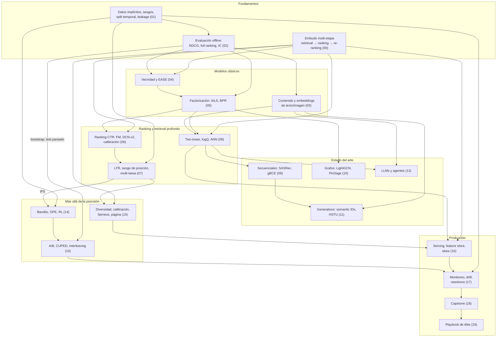

# 🧭 Guía de estudio · «Sistemas de Recomendación: de cero a nivel Netflix»

Esta guía te dice **en qué orden** estudiar, **cuánto tiempo** reservar, **qué repasar** antes de cada bloque, cómo se
**conectan** los conceptos entre módulos y qué significa cada término clave (glosario ES/EN). Úsala junto al
[README](README.md).

> Pensada para quien ya domina ML, MLOps y agentes LLM. Si algo de esa base te falla (p. ej. PyTorch o
> estadística básica), las cajas 🔁 de cada lección te avisan de qué repasar.

---

## 1. Cómo funciona cada módulo (y cómo sacarle partido)

Cada lección sigue el mismo ciclo: **intuición → ejemplo pequeño a mano → fórmulas → código desde cero → librería de
industria → experimento → producción → secretos de la élite → autoevaluación**. Para aprender de verdad (no solo
leer):

1. **🔁 Conexión con módulos anteriores** (justo tras los objetivos): responde las preguntas **de memoria** antes de
   abrir las respuestas. Es práctica de recuperación: cuesta un poco y por eso fija lo aprendido.
2. **👀 Qué debes observar** (tras los gráficos clave): antes de leer la caja, intenta decir tú qué muestra el gráfico.
   Luego compara.
3. **📝 Autoevaluación**: las preguntas marcadas **(Cálculo)**, **(Razonamiento)**, **(Diagnóstico)** o
   **(Transferencia)** son las que se parecen a una entrevista o a un incidente real. No las saltes.
4. **Proyecto**: intenta cada TODO sin ayuda; si te atascas más de 15–20 minutos, abre la **🪜 Pista 1**; después la
   **🪜 Pista 2**; solo al final, el **⛔ SPOILER**. Usa siempre `FAST_DEV_RUN=True` primero y escala después.
5. **Repaso espaciado**: al empezar cada bloque, rehaz las autoevaluaciones del bloque anterior (5 minutos por
   módulo). El compendio del módulo 18 incluye una tabla «secreto → módulo» pensada para repasar antes de entrevistas.

---

## 2. Ruta recomendada y tiempos

Tiempos orientativos (lección + proyecto) tomados de las cabeceras de cada notebook.

| Bloque | Módulos | Horas aprox. | Ritmo sugerido (≈ 8–10 h/semana) | Nivel |
|---|---|---|---|---|
| I · Fundamentos | 00 · 01 · 02 | ≈ 16 h | semanas 1–2 | 🟢 → 🟡 |
| II · Clásicos | 03 · 04 · 05 | ≈ 24 h | semanas 3–5 | 🟢 → 🟠 |
| III · Ranking y deep learning | 06 · 07 · 08 | ≈ 33 h | semanas 6–9 | 🟡 → 🟠 |
| IV · Estado del arte | 09 · 10 · 11 · 12 | ≈ 38 h | semanas 10–13 | 🟠 → 🔴 |
| V · Más allá de la precisión | 13 · 14 · 15 | ≈ 30 h | semanas 14–17 | 🟠 → 🔴 |
| VI · Producción, capstone y élite | 16 · 17 · 18 · 19 | ≈ 64 h (el capstone, 15–25 h) | semanas 18–24 | 🔴 |
| **Total** | 20 módulos | **≈ 190–220 h** | **≈ 6 meses** | |

**Orden flexible (sin romper prerrequisitos):**
- **00 → 01 → 02 son obligatorios y en orden**: todo el curso usa el split temporal del 01 y el evaluador del 02.
- El **bloque V (13–15) puede ir antes que el IV (09–12)**: solo depende de 01–08. Si tu objetivo es producción o
  entrevistas de *system design*, haz I → II → III → V → VI y deja el IV para después.
- **12 (LLMs y agentes)** necesita 03 y 08; 09 y 11 son recomendables pero no imprescindibles.
- **16–17 (producción y MLOps)** necesitan 02, 05, 06, 08 y 13; ayudan 14–15.
- **18 (capstone)** integra 00–17. **19** da por sabidos 06, 07, 08, 13, 14, 15, 16, 17 y 18.

**Módulos densos (hazlos en dos sesiones):** 06 (núcleo LR → FM → DCN-v2 → LightGBM → calibración), 12 (A: el LLM en
el embudo; B: agente y evaluación), 15 (núcleo §1–9; ampliación §10–13) y 19 (A: §0–4; B: §5–8). Cada lección lo
indica en su caja 🧭.

**Ruta exprés (≈ 90 h) para entrevistas de recsys:** 00, 01, 02, 04, 05, 06, 07 (§1–6), 08, 09 (§1–4), 13, 15 (núcleo),
16, 17 y el §3–4 del 18 (compendio y *system design*), más el §6 del 19 (*casebook*).

---

## 3. Qué repasar antes de cada bloque

| Antes del bloque | Repasa (y comprueba con la autoevaluación indicada) | Fuera del curso, si lo tienes oxidado |
|---|---|---|
| **I** | — | pandas/NumPy, `scipy.sparse` básico |
| **II** | 01: split temporal y *leakage*; 02: NDCG, Recall@K, cobertura, test pareado | álgebra lineal (SVD, mínimos cuadrados, ridge) |
| **III** | 02: NDCG y GAUC; 05: MF, BPR (pérdida por pares), ALS; 00: el embudo | PyTorch (embeddings, `nn.Module`, bucles de entrenamiento), regresión logística y calibración |
| **IV** | 08: two-tower, *sampled softmax*, logQ, ANN; 03: embeddings de texto; 06: DIN | Transformers (atención causal, MLM), beam search; LangGraph para el 12 |
| **V** | 01: sesgos y *feedback loop*; 02: métricas *beyond-accuracy* y bootstrap; 07: IPS y sesgo de posición | estadística: t-test, potencia, intervalos de confianza |
| **VI** | 06: *point-in-time*; 08: FAISS; 13: re-ranking; 14: propensiones; 15: A/B y SRM | Docker, FastAPI, MLflow (ya los dominas: aquí cambia lo específico de recsys) |

---

## 4. Mapa de conceptos y dependencias

Cada flecha significa «se necesita para entender». Los números son módulos.

**Hilos que recorren todo el curso** (los verás varias veces, a propósito):
- **Sesgo de exposición / feedback loop**: 01 (simulación) → 02 (offline premia imitar) → 07 (posición) → 13 (re-ranking
  y exploración) → 14 (propensiones y OPE) → 17 (operación) → 19 (*exposure bias* entre etapas).
- **Leakage temporal / point-in-time**: 01 → 02 → proyecto 06 (contadores PIT) → 16 (Feast) → 19 (fugas en contadores).
- **Negativos y su corrección**: 01 (falsos negativos) → 05 (BPR) → 08 (in-batch, logQ, MNS) → 09 (gBCE) → 11.
- **El recall del retrieval es el techo**: 00 → 08 → 12 (re-ranker LLM) → 18 (recall de la unión de fuentes).
- **Offline ≠ online**: 00 → 02 → 13 → 14 → 15 → 17 → 19 (*casebook*).

---

## 5. Glosario ES/EN de términos clave

Se indica el término en inglés tal como se usa en la industria (y en el curso) y el módulo donde aparece por primera
vez o se estudia a fondo.

| Término (ES) | Inglés | Qué es, en una línea | Módulo |
|---|---|---|---|
| Sistema de recomendación | *recommender system, recsys* | Software que decide qué subconjunto del catálogo mostrar, en qué orden y dónde | 00 |
| Generación de candidatos / recuperación | *retrieval, candidate generation* | Etapa barata que reduce millones de ítems a cientos o miles; optimiza recall | 00, 08 |
| Ranking | *ranking* | Etapa cara que ordena los candidatos con muchas *features* | 00, 06 |
| Re-ranking | *re-ranking* | Ajuste final de la lista: diversidad, calibración, reglas, exploración | 00, 13 |
| Embudo multi-etapa | *multi-stage funnel / cascade* | Retrieval → ranking → re-ranking con presupuestos de latencia | 00 |
| Feedback explícito / implícito | *explicit / implicit feedback* | Valoraciones declaradas vs señales de comportamiento (play, % visto) | 00, 01 |
| Arranque en frío | *cold start* | Ítem o usuario sin interacciones suficientes para el modelo colaborativo | 00, 03 |
| Filtrado colaborativo | *collaborative filtering (CF)* | Recomendar por patrones de co-consumo de otros usuarios | 00, 04 |
| Cola larga | *long tail* | Muchos ítems con pocas interacciones frente a una cabeza muy popular | 01 |
| Faltante no aleatorio | *missing not at random (MNAR)* | La probabilidad de observar un dato depende de su valor | 01 |
| Sesgo de exposición | *exposure bias* | Solo observas feedback de lo que el sistema mostró | 01, 19 |
| Sesgo de posición | *position bias* | Lo de arriba recibe más clics por estar arriba | 01, 07 |
| Bucle de retroalimentación | *feedback loop* | El modelo genera los datos con los que se reentrenará | 00, 01, 13 |
| Fuga de información | *data leakage* | Usar información no disponible en el momento de predecir | 01 |
| Split temporal global | *global temporal split* | Un único instante de corte: entrenar con el pasado, evaluar con el futuro | 01 |
| Dejar uno fuera | *leave-one-out (LOO)* | Último ítem de cada usuario a test; protocolo de papers con fuga entre usuarios | 01, 09 |
| Negativo muestreado | *negative sampling* | Elegir ítems no observados como negativos para entrenar | 01, 05, 08 |
| Ranking completo | *full ranking* | Evaluar contra todo el catálogo, no contra una muestra de negativos | 02 |
| Métricas muestreadas | *sampled metrics* | Evaluar con 1 positivo + N negativos; inconsistentes con el ranking completo | 02 |
| Ganancia acumulada descontada normalizada | *NDCG* | Métrica de lista que premia poner lo relevante arriba | 02 |
| Diversidad intra-lista | *intra-list diversity (ILD)* | Disimilitud media entre pares de una lista | 02, 13 |
| Cobertura de catálogo | *catalog coverage* | Fracción del catálogo que llega a recomendarse | 02 |
| Brecha offline-online | *offline-online gap* | Mejoras offline que no se trasladan al A/B | 02, 19 |
| Contracción | *shrinkage* | Encoger similitudes con poco soporte hacia 0 | 04 |
| Factorización matricial | *matrix factorization (MF)* | Aproximar la matriz usuario×ítem con dos matrices de factores latentes | 05 |
| Mínimos cuadrados alternos implícitos | *iALS* | MF para feedback implícito con confianza; alterna regresiones ridge | 05 |
| Ranking personalizado bayesiano | *BPR* | Pérdida por pares: el positivo debe puntuar más que el negativo | 05 |
| Incorporación de usuario nuevo | *fold-in* | Calcular el vector de un usuario nuevo con los factores de ítem fijos | 05 |
| Tasa de clics | *CTR* | Probabilidad de clic de una impresión; objetivo típico del ranker | 06 |
| Truco del hashing | *hashing trick* | Mapear IDs a un número fijo de cubos (con colisiones) | 06, 19 |
| Calibración (de probabilidades) | *calibration* | Que p̂ = 0,2 signifique un 20 % de clics | 06 |
| Calibración (de listas) | *calibrated recommendations* | Que la mezcla de géneros de la lista refleje la del historial (Steck) | 13 |
| Aprendizaje de ranking | *learning to rank (LTR)* | Entrenar directamente para ordenar (pairwise, listwise, LambdaMART) | 07 |
| Aprendizaje multi-tarea | *multi-task learning (MTL)* | Un modelo que predice varios objetivos (clic, tiempo, like) | 07 |
| Fenómeno balancín | *seesaw phenomenon* | Mejorar una tarea empeora otra | 07 |
| Dos torres | *two-tower* | Torre de usuario y de ítem; score = producto escalar; habilita ANN | 08 |
| Negativos dentro del lote | *in-batch negatives* | Usar los positivos de otras filas del batch como negativos | 08 |
| Corrección logQ | *logQ correction* | Restar log de la frecuencia de muestreo para quitar el sesgo de los negativos | 08 |
| Vecinos más cercanos aproximados | *approximate nearest neighbors (ANN)* | Búsqueda sublineal de los K vectores más parecidos (FAISS, HNSW) | 08 |
| Recomendación secuencial | *sequential recommendation* | Predecir el siguiente ítem a partir del historial ordenado | 09 |
| Sobresuavizado | *over-smoothing* | En GNNs profundas todos los embeddings acaban pareciéndose | 10 |
| Identificadores semánticos | *semantic IDs* | Tuplas de códigos (RQ-VAE) donde ítems parecidos comparten prefijo | 11 |
| Leyes de escalado | *scaling laws* | Relación de potencia entre calidad y cómputo/parámetros/datos | 11 |
| LLM como juez | *LLM-as-judge* | Usar un LLM para evaluar recomendaciones o explicaciones | 12 |
| Relevancia marginal máxima | *MMR* | Re-ranking greedy que penaliza la similitud con lo ya elegido | 13 |
| Proceso puntual determinantal | *DPP* | Selección de conjuntos que premia calidad y diversidad (determinante) | 13 |
| Frente de Pareto | *Pareto front* | Configuraciones no dominadas entre objetivos que compiten | 07, 13 |
| Bandit multibrazo / contextual | *multi-armed / contextual bandit* | Decidir qué mostrar equilibrando explorar y explotar | 14 |
| Evaluación fuera de política | *off-policy evaluation (OPE)* | Estimar el valor de una política nueva con logs de otra | 14 |
| Ponderación por propensión inversa | *inverse propensity scoring (IPS)* | Reponderar cada evento por 1 / probabilidad de haberlo mostrado | 07, 14 |
| Doblemente robusto | *doubly robust (DR)* | Estimador OPE que combina modelo de recompensa e IPS | 14 |
| Tamaño muestral efectivo | *effective sample size (ESS)* | Diagnóstico de la varianza de los pesos de importancia | 14 |
| Test A/B | *A/B test* | Experimento controlado online con usuarios asignados al azar | 15 |
| Efecto mínimo detectable | *minimum detectable effect (MDE)* | El efecto más pequeño que el experimento puede detectar con la potencia fijada | 15 |
| Desajuste del reparto de muestra | *sample ratio mismatch (SRM)* | Reparto de usuarios distinto del diseñado: el análisis no es fiable | 15 |
| Reducción de varianza CUPED | *CUPED* | Ajuste con la métrica pre-experimento como covariable | 15 |
| Intercalado | *interleaving* | Mezclar las listas de dos rankers para cada usuario y ver cuál prefiere | 15 |
| Efecto novedad / primacía | *novelty / primacy effect* | El efecto inicial de un cambio no es el estable | 15 |
| Índice sustituto | *surrogate index* | Métricas a corto plazo que predicen el efecto a largo plazo | 15 |
| Corrección temporal de features | *point-in-time correctness* | Calcular cada feature solo con lo que se sabía en ese instante | 16 |
| Almacén de features | *feature store* | Sistema que sirve features consistentes en entrenamiento y serving (Feast) | 16 |
| Desfase entrenamiento-servicio | *training-serving skew* | Las features servidas difieren de las de entrenamiento por culpa del sistema | 16, 19 |
| Latencia de cola | *tail latency (p99)* | Percentil alto de la latencia; manda en sistemas con *fan-out* | 16 |
| Deriva | *drift (data / concept / prediction)* | Cambio en P(X), P(Y\|X) o P(ŷ) a lo largo del tiempo | 17 |
| Fuera de vocabulario | *out-of-vocabulary (OOV)* | Interacciones con ítems que el modelo no conoce (catálogo nuevo) | 17 |
| Entrenamiento continuo | *continuous training (CT)* | Pipeline que reentrena y promueve modelos automáticamente | 17 |
| Despliegue en sombra / canario | *shadow / canary deployment* | Probar el modelo nuevo sin impacto o con un % pequeño de tráfico | 17 |
| Esqueleto andante | *walking skeleton* | Versión mínima de punta a punta que luego se mejora pieza a pieza | 18 |
| Retraso de etiquetas | *label delay* | La conversión llega días después del clic | 19 |
| Grupo de control global | *global holdout* | Usuarios sin lanzamientos para medir el valor acumulado del sistema | 19 |
| Consultas de referencia | *golden queries* | Consultas con respuesta conocida para detectar regresiones silenciosas | 19 |

---

## 6. Antes de dar el curso por terminado

- [ ] Sabes explicar en 1 minuto, con números, por qué existe el embudo multi-etapa (00).
- [ ] Tu evaluador del 02 da los mismos números que `ranx` y lo has usado en todos los proyectos.
- [ ] Has batido a popularidad **y** a EASE/iALS bien tuneados en un split temporal (04–05).
- [ ] Has corregido un sesgo de posición y uno de exposición con propensiones (07, 14).
- [ ] Has elegido un punto operativo de un frente de Pareto y lo has defendido con guardrails (13, 15).
- [ ] Tu CineMatch del capstone responde en el SLO, tiene paridad de features y una decisión de reentreno trazada (18).
- [ ] Has resuelto los 6 bugs del proyecto 19 en el orden del árbol de triaje.
- [ ] Puedes recitar 10 secretos del compendio (18) con su fuente y el módulo donde los practicaste.
