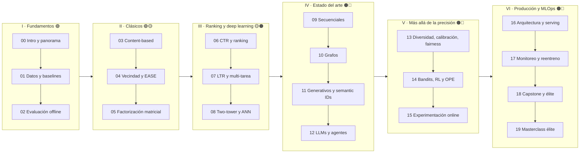

# 🎬 Sistemas de Recomendación: de cero a nivel Netflix

Curso práctico en español sobre sistemas de recomendación (*recommender systems*), desde lo más básico hasta lo que hacen los equipos de personalización de Netflix, YouTube, Meta, TikTok o Spotify. Cubre los modelos, la producción y el ciclo de vida completo (MLOps, monitoreo y reentreno).

Está pensado para quien **ya domina machine learning, MLOps y agentes LLM, pero nunca ha trabajado con sistemas de recomendación**. Todo corre en **Google Colab** (con GPU T4 / L4 / A100 donde hace falta). Cada sesión tiene una **lección** con teoría, código y gráficos, y un **proyecto** con plantilla de TODOs y solución de referencia.

> **Proyecto hilo conductor: CineMatch.** Durante todo el curso construyes, pieza a pieza, la plataforma de recomendación de un servicio de streaming ficticio. En el capstone (módulo 18) la integras entera: datos → retrieval → ranking → re-ranking → serving → monitoreo → reentreno → agente conversacional.

---

## 🗺️ Mapa del curso



## 🏗️ La arquitectura que vas a dominar

Casi todos los recomendadores a gran escala siguen el mismo embudo de varias etapas. El curso lo recorre entero:

```mermaid
flowchart LR
    U((Usuario)) --> R
    C[(Catálogo<br/>millones de ítems)] --> R
    R["Retrieval / Candidate generation<br/>ALS · two-tower · grafos · secuenciales<br/>FAISS / ANN<br/><b>10⁶ → 10³</b>  (módulos 04-05, 08-11)"]
    R --> RK["Ranking<br/>GBDT · DCN-v2 · DIN · multi-tarea<br/><b>10³ → 10²</b>  (06-07)"]
    RK --> RR["Re-ranking y políticas<br/>diversidad · calibración · bandits · reglas<br/><b>10² → 10</b>  (13-14)"]
    RR --> P[Página / fila de la home]
    P -- "eventos (clics, vistas, % visto)" --> L[(Logs / Kafka)]
    L --> F[Feature store · entrenamiento · evaluación<br/>A/B · monitoreo · reentreno  (15-17)]
    F --> R & RK & RR
```

---

## 📚 Temario

Nivel: 🟢 Básico · 🟡 Intermedio · 🟠 Avanzado · 🔴 Experto

| # | Módulo | Nivel | Lo que aprendes | Proyecto |
|---|--------|-------|-----------------|----------|
| 00 | [Introducción y panorama](00_intro/) | 🟢 | Qué es un recsys, tipos, arquitectura multi-etapa, ciclo de vida, stack, historia (Tapestry → Netflix Prize → transformers → generativos) | EDA de MovieLens y primer recomendador por popularidad |
| 01 | [Datos de interacción y baselines](01_data/) | 🟢 | Feedback explícito e implícito, matrices dispersas, long tail, sesgos, splits temporales, *leakage*, catálogo de datasets | Pipeline de datos reproducible de CineMatch |
| 02 | [Evaluación offline rigurosa](02_evaluation/) | 🟢🟡 | Precision/Recall, NDCG, MAP, MRR, coverage, novedad, *sampled metrics*, significancia, crisis de reproducibilidad | Tu propia librería de evaluación, validada contra `ranx` |
| 03 | [Basado en contenido y embeddings](03_content_based/) | 🟢 | TF-IDF, BM25, sentence-transformers (BGE/E5), CLIP, cold start | "Más como esta" con sinopsis y pósters |
| 04 | [Vecindad y modelos lineales](04_neighborhood_linear/) | 🟡 | user/item-kNN, similitudes, shrinkage, SLIM, **EASE**, RP3beta | item-kNN vs EASE en MovieLens-1M |
| 05 | [Factorización matricial](05_matrix_factorization/) | 🟡 | Netflix Prize, FunkSVD, SVD++, **ALS implícito**, **BPR**, WARP, iALS revisitado | ALS + BPR en GPU con Optuna |
| 06 | [Predicción de CTR y ranking](06_ctr_ranking/) | 🟡🟠 | LR + hashing, FM, FFM, GBDT, Wide&Deep, DeepFM, **DCN-v2**, **DIN**, calibración | Ranker DCN-v2 vs LightGBM |
| 07 | [Learning to Rank y multi-tarea](07_learning_to_rank_multitask/) | 🟠 | RankNet → **LambdaMART**, ListNet, sesgo de posición, **MMoE**, **PLE**, ESMM | Ranker multi-objetivo para la home |
| 08 | [Deep retrieval y ANN](08_deep_retrieval_ann/) | 🟠 | YouTube DNN, **two-tower**, *in-batch negatives*, logQ, *hard negatives*, **FAISS**, HNSW, vector DBs | Two-tower + FAISS sirviendo top-K en ms |
| 09 | [Recomendación secuencial](09_sequential/) | 🟠 | GRU4Rec, **SASRec**, BERT4Rec, gSASRec, Transformers4Rec | SASRec para "siguiente película" |
| 10 | [Recomendadores en grafos](10_graph/) | 🟠 | item2vec, node2vec, **PinSage**, **LightGCN**, PyTorch Geometric | LightGCN vs MF |
| 11 | [Recomendadores generativos](11_generative_recsys/) | 🔴 | **HSTU** (Meta), **semantic IDs**, **TIGER**, RQ-VAE, OneRec, foundation models (Netflix), scaling laws | Semantic IDs + retrieval generativo |
| 12 | [LLMs y agentes en recomendación](12_llm_agents_recsys/) | 🔴 | LLM como encoder y como ranker, LoRA (TALLRec), LLM-as-judge, **agente conversacional con LangGraph**, simulación de usuarios | Agente CineMatch con LangGraph + FAISS + reranker LLM |
| 13 | [Más allá de la precisión](13_beyond_accuracy/) | 🟠 | **MMR**, **DPP**, calibración (Steck), popularity bias, feedback loops, fairness, Pareto, optimización a nivel de página | Re-ranker de la home: relevancia + diversidad + calibración |
| 14 | [Bandits, RL y off-policy evaluation](14_bandits_rl_ope/) | 🔴 | UCB, Thompson, **LinUCB**, artwork de Netflix, **IPS/SNIPS/DR**, Open Bandit Pipeline, REINFORCE top-K, SlateQ | Bandit contextual de artwork evaluado *off-policy* |
| 15 | [Experimentación online](15_online_experimentation/) | 🟠🔴 | A/B testing, potencia, **CUPED**, **interleaving**, novelty effects, interferencia, surrogate metrics | Simulador de A/B + interleaving |
| 16 | [Arquitectura de producción y serving](16_production_serving/) | 🔴 | Offline/nearline/online, latencia, **Feast**, **Kafka**, Redis, FastAPI, **Triton**, BentoML, Ray Serve, **TorchRec**, **Merlin** | CineMatch como microservicio |
| 17 | [MLOps: monitoreo y reentreno](17_mlops_monitoring/) | 🔴 | **MLflow**, Prefect/Airflow/Metaflow, Pandera, **Evidently**, drift, feedback loops, reentreno continuo, shadow/canary | Pipeline de entrenamiento continuo con detección de drift |
| 18 | [Capstone y lo que sabe la élite](18_capstone/) | 🔴 | Sistema end-to-end, compendio de secretos de la élite, *system design interviews*, mapa de papers, ruta de carrera | **CineMatch end-to-end** |
| 19 | [Masterclass: elite playbook](19_elite_playbook/) | 🔴 | Tablas de embeddings (QR, mixed-dim, TT-Rec, cuantización), **Monolith** y online learning, *label delay* (Chapelle), fugas en contadores, **log-and-wait**, Berkson y consistencia del funnel, largo plazo y Goodhart, *casebook* offline↑ online↓, rendimiento y *capacity planning* | ***Pager duty***: depurar CineMatch v2 con 6 bugs plantados |
| 19 | [Masterclass: el playbook de la élite](19_elite_playbook/) | 🔴 | Compresión de tablas de embeddings (hashing, QR, TT-Rec), entrenamiento en tiempo real (Monolith), *label delay*, *training-serving skew*, consistencia entre etapas del embudo, *global holdouts*, casebook de "offline sube / online baja", capacity planning | *Pager duty*: diagnosticar y arreglar 6 bugs plantados en producción |

Cada carpeta contiene:
- `README.md`: objetivos, lecturas y datasets del módulo.
- `NN_<tema>.ipynb`: la **lección** (intuición → matemáticas → implementación desde cero → librerías de industria → experimentos → 🏭 en producción → 🧠 secretos de la élite → autoevaluación).
- `NN_proyecto_<tema>.ipynb`: el **proyecto** (contexto de negocio → plantilla con TODOs → rúbrica → solución de referencia → retos extra).

---

## 🧰 Stack de herramientas que verás

| Etapa | Herramientas |
|-------|--------------|
| Datos y features | pandas, Polars, PyArrow/Parquet, scipy.sparse, DuckDB, **Feast** (feature store), Kafka/Redpanda |
| Modelos clásicos | implicit (ALS/BPR en GPU), Surprise, LightFM, cornac, scikit-learn |
| Deep learning | **PyTorch**, PyTorch Geometric, **TorchRec**, **NVIDIA Merlin** / Transformers4Rec, FuxiCTR, RecBole |
| Ranking | **LightGBM** / XGBoost (lambdarank), DCN-v2, DIN, MMoE/PLE |
| Retrieval / ANN | **FAISS**, ScaNN, hnswlib, Milvus, Qdrant, pgvector, Vespa |
| LLMs y agentes | Hugging Face transformers, sentence-transformers, vLLM, PEFT/LoRA, **LangGraph**, API de Claude |
| Evaluación | ranx, RecBole, Microsoft Recommenders, Open Bandit Pipeline (obp) |
| Experimentación | statsmodels, scipy, GrowthBook / Eppo / Statsig (conceptos) |
| Serving | FastAPI, **NVIDIA Triton**, BentoML, Ray Serve, ONNX, Redis |
| MLOps | **MLflow**, W&B, Prefect / Airflow / Metaflow / Kubeflow, Pandera / Great Expectations, **Evidently**, Prometheus + Grafana, Docker |

## 🗃️ Datasets principales

| Dataset | Dominio | Se usa en |
|---------|---------|-----------|
| MovieLens 100K / 1M / 25M / 32M | Películas (ratings + tags) | Casi todo el curso (CineMatch) |
| Metadatos de películas (TMDB / The Movies Dataset) | Sinopsis, pósters | 03, 12 |
| Amazon Reviews 2023 | E-commerce | 11 |
| KuaiRand / KuaiRec | Vídeo corto, multi-feedback | 07 |
| Criteo / Avazu | Publicidad (CTR) | 06 |
| RetailRocket / Yoochoose / Diginetica | Sesiones de e-commerce | 09 |
| Open Bandit Dataset (ZOZOTOWN) | Moda, logs de bandits | 14 |

Cada notebook descarga sus datos solo y trae un *fallback* (subconjunto o datos sintéticos) por si un dataset pide credenciales.

---

## 🎓 Cómo estudiar el curso

1. **Sigue el orden.** Los módulos 00–02 son la base de todo: el evaluador del 02 lo usarás hasta el final.
2. **Primero la lección, luego el proyecto.** Intenta el proyecto sin mirar la solución. La rúbrica te dice qué métrica tienes que alcanzar.
3. **Itera en pequeño y luego escala.** Cada notebook tiene un flag `FAST_DEV_RUN` / `SCALE` para probar rápido en CPU y luego entrenar a escala completa en GPU.
4. **Lee los papers de cada módulo.** La sección 📚 Referencias está ordenada por prioridad.
5. **Las secciones 🧠 Secretos de la élite** son lo que separa a un buen ingeniero de uno de nivel Netflix. Vuelve a ellas.

### ⚡ Presupuesto de Colab (~200 unidades)

Orientativo. Cada notebook indica al inicio su GPU recomendada y una estimación de unidades.

| Bloque | GPU sugerida | Unidades aprox. |
|--------|-------------|-----------------|
| I–II (00–05) | CPU / T4 | 10–20 |
| III (06–08) | T4 / L4 | 25–40 |
| IV (09–12) | L4 / A100 | 60–90 |
| V (13–15) | CPU / T4 | 5–10 |
| VI (16–18) | T4 / L4 | 20–35 |

Te sobra margen para correr los experimentos a escala completa (MovieLens-25M/32M, LLMs de 7–8B con LoRA) y para los retos extra.

---

## 🛠️ Para mantenedores

Los notebooks se generan con scripts reproducibles:

```bash
pip install nbformat
python recsys-course/_tools/builders/build_05.py   # regenera el módulo 05
```

- `_tools/nbbuild.py`: helper que construye y valida los notebooks (JSON y sintaxis de cada celda).
- `_tools/STYLE_GUIDE.md`: plantillas de lección y proyecto, y normas de estilo.
- `_tools/SYLLABUS.md`: temario detallado por módulo.
